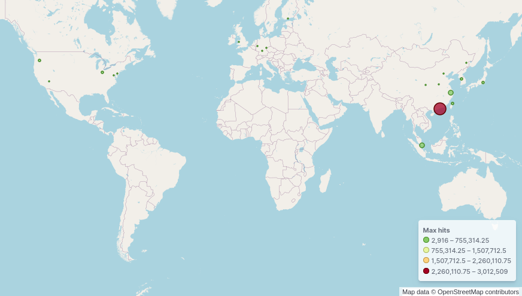
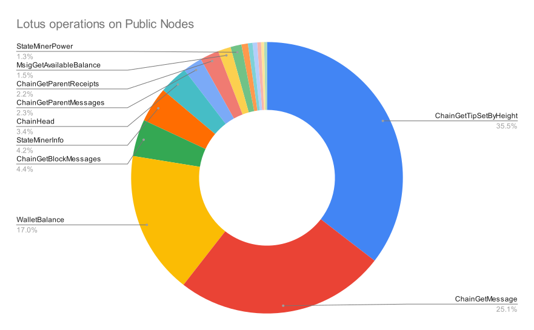
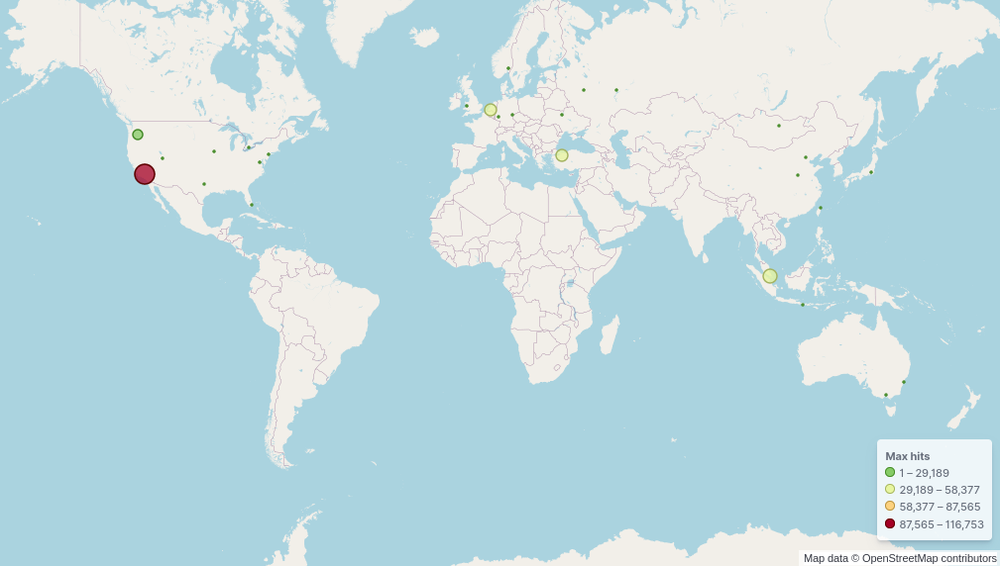
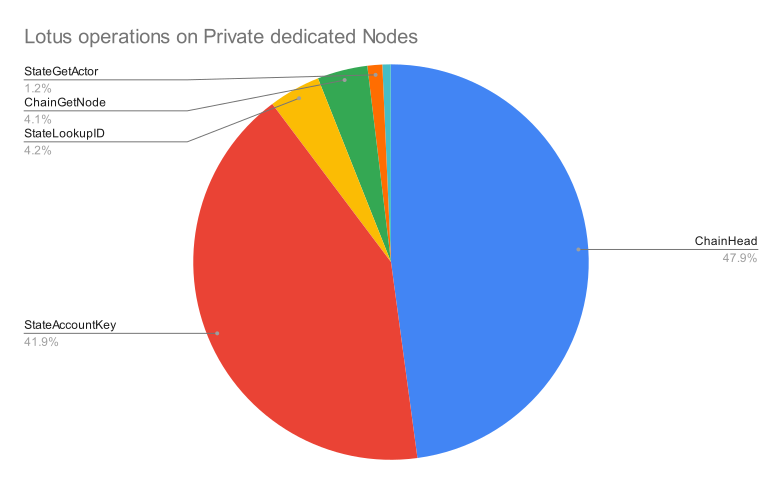

# **Glif Hosted nodes for Filecoin**

https://docs.filecoin.io/build/hosted-lotus/

---

# Glif.io

Glif.io is the partnership between [Protofire](https://protofire.io) and [Infinite scroll](https://www.infinitescroll.org/) teams in providing tools and hosted nodes for Filecoin users.

---

# Nodes team

The team now consists of three members:
* Arsenii Petrovich as Tech Lead
* And two Systems Engineers:
  * Alexey Kulik
  * Uladzislau Muraveika

---

# Nodes
7 lightweight and 3 full nodes

| Nodes                                          | Purpose                                                                            |
| :--------------------------------------------- | :--------------------------------------------------------------------------------- |
| Public testnet node - api.testnet.node.glif.io | Limited read-only API endpoint for everyone, recent 2K blocks guarantied           |
| Dedicated testnet archive node                 | Full history and write access, protected with JWT authorization                    |
| Public nodes - api.node.glif.io                | Limited read-only API endpoint for everyone, recent 2K blocks guarantied           |
| Dedicated nodes                                | Nodes with write access, recent 2K recent blocks, protected with JWT authorization |
| Dedicated archive nodes                        | Full history and write access, protected with JWT authorization                    |

---
# Statistic

#### How many HTTP requests are processed by us per day?

| Network     | Requests     |
| :---------- | :----------- |
| Testnet     | 308 thousand |
| **Mainnet** | 12 million   |

---

## Our uptime for public API is 99.581%

---
### What kind of load we have everyday

Every day we have around:
| Type of nodes | Average ops | Max ops | Percentage ops | Requests | Percentage requests | Unique IPs | Percentage IPs |
| :------------ | :---------- | ------- | -------------- | -------- | ------------------- | ---------- | -------------- |
| Public API    | 97          | 320     | 72%            | 8462168  | 69.5%               | 229091     | 99.3%          |
| Private API   | 39          | 100     | 28%            | 3710022  | 30.5%               | 168        | 0.07%          |
| Total         | 135         | 420     |                | 12172190 |                     | 229259     |                |

---
<!--
color: black
-->

#### Public api usage map

---
<!--
color: white
-->

#### Public api usage by country

| Country        | Requests | Percentage |
| :------------- | :------- | :--------- |
| Hong Kong      | 3789513  | 15%        |
| China          | 1115175  | 12%        |
| Singapore      | 895665   | 8%         |
| United States  | 551737   | 4%         |
| South Korea    | 297403   | 4%         |
| Japan          | 263502   | 2%         |
| Taiwan         | 163503   | 2%         |
| Germany        | 127747   | 1%         |
| United Kingdom | 66751    | 1%         |
| Ireland        | 14431    | 1%         |

---
#### Public api usage by provider

| Provider                                 | Requests | Percentage |
| :--------------------------------------- | :------- | :--------- |
| Alibaba US Technology Co., Ltd.          | 3625384  | 23%        |
| AMAZON-02                                | 1595629  | 7 %        |
| CHINA UNICOM China169 Backbone           | 475482   | 6 %        |
| Hangzhou Alibaba Advertising Co.,Ltd.    | 429152   | 5 %        |
| GOOGLE-CLOUD-PLATFORM                    | 358457   | 3 %        |
| Tencent Building, Kejizhongyi Avenue     | 197013   | 2 %        |
| China Telecom Group                      | 118139   | 2 %        |
| Hetzner Online GmbH                      | 115613   | 1 %        |
| UCLOUD INFORMATION TECHNOLOGY HK LIMITED | 84947    | 1 %        |
| AMAZON-AES                               | 67955    | 1 %        |

---
## Lotus operations on Public Nodes

| Operations                | Requests |
| :------------------------ | -------: |
| ChainGetTipSetByHeight    |  3084821 |
| ChainGetMessage           |  2181964 |
| WalletBalance             |  1481469 |
| ChainGetBlockMessages     |   382610 |
| StateMinerInfo            |   364538 |
| ChainHead                 |   299377 |
| ChainGetParentMessages    |   200138 |
| ChainGetParentReceipts    |   195011 |
| MsigGetAvailableBalance   |   133036 |
| StateMinerPower           |   113464 |
| StateMinerPartitions      |    66842 |
| StateSearchMsg            |    48046 |
| StateMinerProvingDeadline |    47623 |
| NetFindPeer               |    39647 |
| StateMinerSectorCount     |    30819 |
| StateGetActor             |    30596 |

---

---
<!--
color: black
-->

#### Private api usage map

---
#### Private api usage by country
<!--
color: white
-->

| Country        | Requests | Percentage |
| :------------- | :------- | :--------- |
| United States  | 145008   | 41%        |
| Singapore      | 110518   | 32%        |
| Turkey         | 51678    | 15%        |
| Netherlands    | 41564    | 12%        |
| United Kingdom | 170      | 0.05%      |
| Ukraine        | 138      | 0.04%      |
| Germany        | 137      | 0.04%      |
| Russia         | 124      | 0.04%      |
| China          | 73       | 0.02%      |
| Taiwan         | 45       | 0.01%      |

---
#### Private api usage by provider

| Provider                         | Requests | Percentage |
| :------------------------------- | :------- | :--------- |
| IT7NET                           | 116753   | 33.45%     |
| GOOGLE-CLOUD-PLATFORM            | 83084    | 23.8%      |
| HUAWEI CLOUDS                    | 53772    | 15.4%      |
| TurkNet Iletisim Hizmetleri A.S. | 51671    | 14.8%      |
| MICROSOFT-CORP-MSN-AS-BLOCK      | 41636    | 11.93%     |
| LIMESTONENETWORKS                | 1400     | 0.4%       |
| AMAZON-02                        | 280      | 0.08%      |
| DIGITALOCEAN-ASN                 | 200      | 0.06%      |
| OVH SAS                          | 149      | 0.04%      |
| Virtual Systems LLC              | 138      | 0.04%      |

---
## Lotus operations on Private dedicated Nodes

| Operations             | Requests |
| :--------------------- | -------: |
| ChainHead              |  1211321 |
| StateAccountKey        |  1059851 |
| StateLookupID          |   107105 |
| ChainGetNode           |   103937 |
| StateGetActor          |    30773 |
| ChainGetGenesis        |    17280 |
| StateCirculatingSupply |      288 |
| StateSearchMsg         |      111 |
| MpoolGetNonce          |       15 |
| ChainGetTipSetByHeight |       10 |

---

---
# Our future plans

* move our cluster closer to East and Southeast Asia region
* create our cluster with Infra as code approach - done for testnet cluster, preparing to prod
  * we will share our approach and opensource it
* make Lily nodes production ready and add GraphQL that can be used by everybody
* Add support of lotus lite nodes connection to our nodes
* Check possibility to move from Amazon API Gateway to Lotus API Gateway

---
## Feel free to contact with us

#### [\#fil-glif-node-hosting](https://filecoinproject.slack.com/archives/C017HM9BJ8Z) in the Filecoin Slack
#### Just send GET request towards api.node.glif.io

